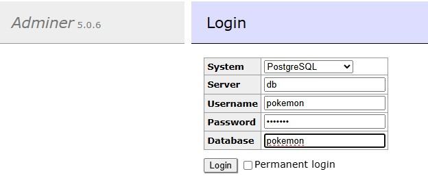

# Pokémon Battle field - 48 hours

## Problem statement

Implement and code a program that receives the names of 2 Pokémon and simulates a battle between the two, the winner will be decided by a calculation of the stats.change field.

In addition to this, you should show each Pokémon ID card (general information) by fetching data from the pokeapi.co for each given name .

- Use models for the Pokémon
- The program should handle errors.
- The program should have a cache mechanism.
- Use Docker containers
- All battle data should be saved in a DB (up to you which db to use)
- The project should include unit tests and documentation.

https://pokeapi.co/

## Assumptions

1. Pokémon data are stable, no need to refresh the cache once acquired
2. Speed increase the probability to attack
3. Speed increase the probability to choose a special attack, more special attacks a Pokémon has more luckily is going to use it
4. attack might increase the attacker HP or decrease the defender HP dependently of the characteristics of the attack

## Installation

### Prerequisites

- Docker version 28.0.0
- Docker compose compatible version
- Docker build kit (enable docker buildx build)

### installation

1. Download the project from the public GitHub repo: `git clone https://github.com/lucapf/pokemon-challenge.git` or download the zip file and unpack it
2. get into the project directory `cd pokemon-challenge`
3. execute the build script `./build.sh`.  the script will:
    1. build the images for the backend and database
    2. start the application (non daemon mode)
4. exposed entry points:
    1. Pokémon challenge application on port 8000  (`http://localhost:8000`)
    2. `Adminer` database management tool on port 8080 (`http://localhost:8080)

### Adminer



Default credentials:

```text
- system: PostgreSQL
- user name: pokemon
- password: pokemon
- database: pokemon
```

## Pokémon selection

### base flow

1. The operator insert the name of the Pokémon
2. the system checks if the Pokémon exists.
3. fetch the Pokémon data and shown basic information (name, image (generation-viii then back), HP points, attack and defense moves ).
4. the operator choose the second Pokémon.
5. the system shown the Pokémon cards
6. the operator press the Battle button
7. the system shown
   1. the winner (if one otherwise "no winner")
   2. the list of the attack/defense moves of the battle and damage

### Validation checks

The system validates the Pokémon name before requests to `pokeapi`.
Checks:

- name should not be null
- allowed chars `[a-z0-9-]` (alphanumeric + "-")
- name cannot exceed 150 chars

If a validation check fail, the system shown a red banner with proper message

If Pokémon is not found (`pokeapi.co`) the system shown an orange warning banner with the message `Pokemon {name} not found`

Following image shown the interface and banners:


### Pokémon Card

For both competitors, once selected, the system shown a card:

- image
- Name
- HP and speed points
- list of attack/defense special attack and special defense moves with damage points


## Battle

1. the operator press the "battle" button
2. the system checks if all requirement for the battle to be engaged are met
3. the system:
    1. choose one of the Pokémon as attacker
    2. choose the attack move (between normal and special attack moves)
    3. choose one of the defense moves for the defender
    4. if the attacker choose a move with negative change, decrease the defender HP accordingly
    5. if the defender choose a move with negative change, decrease the attacker HP accordingly
    6. if hp > 0 for both  and the cycle limit (200) is not reached, restart for the point 3.1
4. the system persist finalize the battle:
    - Persist all battle information (battle with winner + attacks)
    - show to the user the winner (if any) and the list of attack / defense moves

The image below shown the structure:


### Choose attacker

Pokémon with highest speed more likely will be an attacker:

```text
Attack Probability = pokemon.speed / (pokemon.speed + adversary.speed)
```

### Choose attack move

happen in two steps:

#### Choose between regular or special attack

weighted by: Speed and number of special attack moves

```text
Special Attack Proabability: 
Attack Probability * ( num(special attack moves)/ (num(regular moves ) + num(special attack moves)))
```

#### Choose the move

just randomly choose a move between the available

## Data structures


### Table Battle

store the summary information of the battle

- participants
- initial hp
- winner

### Table attack

Store information about single couple of moves (attack, defense)

- who is the attacker and defender
- attack/defense move
- attack damage
- defense damage

## Caching

All information retrieved by the `pokeapi.co` website are cached without expiration following the principle that Pokémon data are immutable.